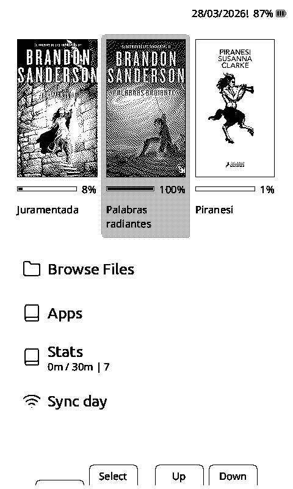
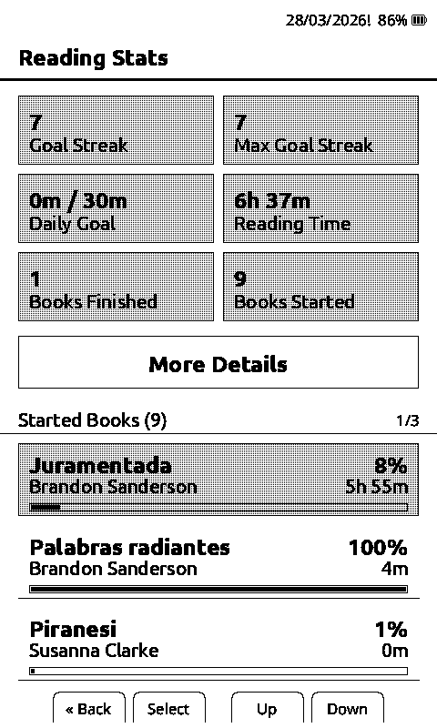
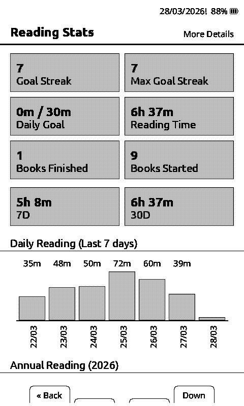
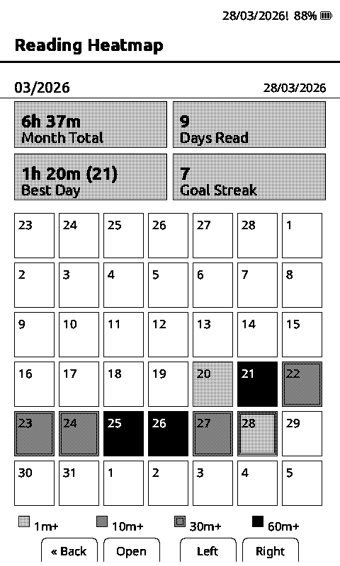
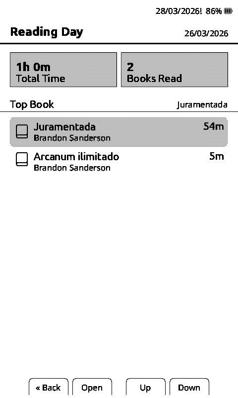
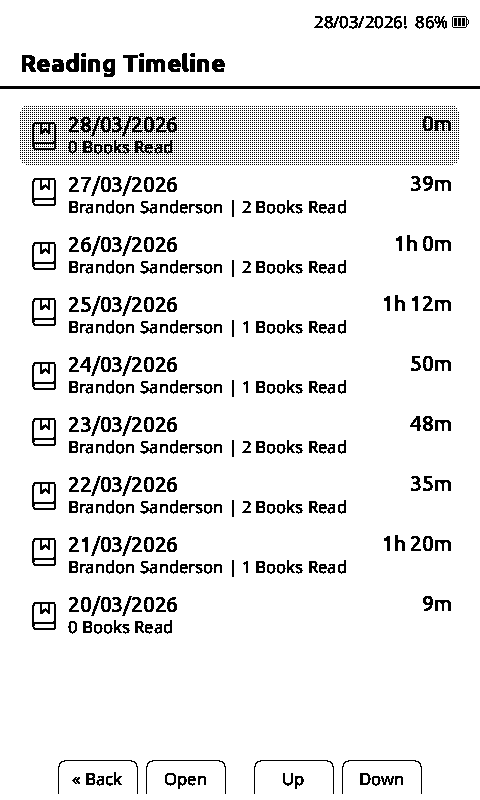
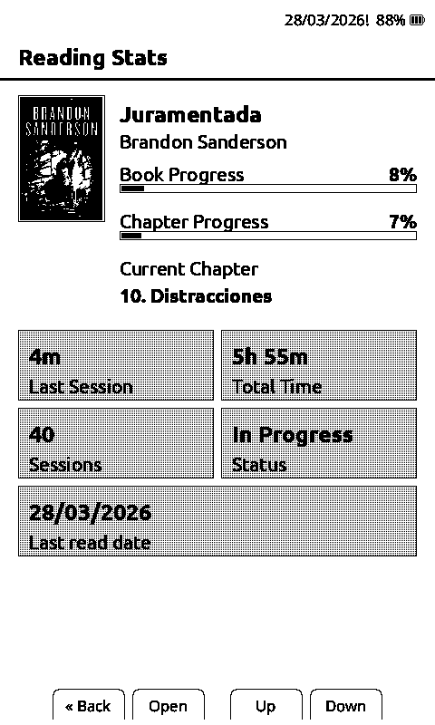

# crosspoint-vcodex

`crosspoint-vcodex` is a feature-focused fork of **CrossPoint Reader** for the **Xteink X4**.

It keeps the CrossPoint Reader base and adds a more complete day-to-day reading experience:

- better Home workflow
- configurable Home and Apps shortcuts
- richer reading analytics
- achievements
- Sync Day for coherent date-based stats
- heatmap and timeline views
- EPUB bookmarks with a global app
- visible firmware version code on boot

This project is **not affiliated with Xteink**.

Current release line:

- version: `1.1.2-vcodex`
- version code: `2026032902`
- release notes: [CHANGELOG.md](./CHANGELOG.md)

## Easy installation

For most users, this is the easiest way to install the firmware:

1. Download the latest `crosspoint-vcodex` release from [GitHub Releases](https://github.com/franssjz/crosspoint-reader-codex/releases).
2. Turn on and unlock your Xteink X4.
3. Open [xteink.dve.al](https://xteink.dve.al/).
4. In `OTA fast flash controls`, select the downloaded firmware file.
5. Click `Flash firmware from file`.
6. Select the device when the browser asks.
7. Wait for the installation to finish.
8. Restart the device:
   press the bottom-right button once, then press and hold the right power button.
9. Enjoy.

To return to the original CrossPoint Reader later, just repeat the same process with the original firmware file.

## Feature map

Main additions over base CrossPoint Reader, with direct links to the sections that explain how each one works.

- `Lyra Custom` default theme  
  reading-first default presentation with the customized Lyra look from first boot. See [Main experience changes](#main-experience-changes).

- `Home + Shortcuts`  
  configurable Home/Apps placement, reorderable shortcut lists, and a cleaner Home flow built around reading actions. See [Home](#home) and [Shortcuts](#14-shortcuts).

- `Sync Day`  
  manual Wi-Fi day sync plus fallback-day logic so day-based analytics stay coherent on the X4. See [How date and time work](#how-date-and-time-work) and [Sync Day](#1-sync-day).

- `Reading Stats suite`  
  richer reading analytics with started books, per-book detail, aggregate stats, goal progress and extended views. See [Reading Stats suite](#reading-stats-suite), [Reading Stats](#2-reading-stats) and [Per-book stats detail](#6-per-book-stats-detail).

- `Reading Heatmap`  
  monthly reading calendar with intensity, best day and trend visibility. See [Reading Heatmap](#3-reading-heatmap).

- `Reading Day`  
  drill-down view for a single day showing meaningful books and dominant reading activity. See [Reading Day](#4-reading-day).

- `Reading Timeline`  
  recent-history view to answer what you read on each recent day. See [Reading Timeline](#5-reading-timeline).

- `Achievements`  
  console-style gamification with unlock tracking, progress milestones, popups and reset controls. See [Achievements](#achievements) and [Achievements guide](#10-achievements).

- `EPUB Bookmarks + global Bookmarks app`  
  per-book bookmarks from inside the reader plus a central app that jumps back to saved positions. See [Bookmarks](#9-bookmarks).

- `Sleep tools`  
  sleep folder selection, preview, shuffle/sequential behavior and easier custom sleep image management. See [Sleep](#8-sleep).

- `Date controls`  
  configurable date format and time zone used everywhere the firmware prints dates. See [How date and time work](#how-date-and-time-work) and [Settings](#13-settings).

- `Reading stats management`  
  export, import and reset flows for stats, plus consistent JSON persistence on the SD card. See [Reading Stats](#2-reading-stats) and [Data persistence](#data-persistence).

- `Visible firmware version code`  
  boot-time version + version code display so every build is easy to identify. See [Versioning](#versioning).

## Screenshots

<p align="center">
  
  
  
</p>
<p align="center">
  
  
  
</p>
<p align="center">
  
</p>

## Getting started in 5 minutes

If you just flashed the fork and want to use the main extras immediately:

1. Open `Home > Sync Day`
2. Connect to Wi-Fi and sync the date
3. Open a book and read normally
4. Check `Home > Stats` or `Apps > Reading Stats`
5. Open `Apps > Reading Heatmap` or `Apps > Reading Timeline` to review activity by day

That is enough to use the fork's main value: coherent day-based reading stats on the X4.

## Basic controls

The firmware keeps the standard Xteink X4 reading flow simple:

- bottom buttons are used for `Back`, `Confirm`, and front navigation
- side buttons are used for reading navigation
- `Confirm` usually opens or selects
- `Back` usually returns to the previous screen
- while reading, `Confirm` opens the reader menu
- long-press actions are used in a few places for secondary or destructive actions, such as deleting stats or bookmarks

## Main experience changes

### Home

The Home screen is simplified and reading-first.

Current main menu order:

- `Browse Files`
- `Apps`
- `Stats`
- `Sync Day`

The Home screen also keeps:

- recent book covers at the top
- per-book progress under recent covers in `Lyra Custom`
- optional date in the header
- a compact stats subtitle under `Stats`

Home shortcuts are configurable:

- shortcuts can be assigned to `Home` or `Apps` in `Settings > Apps > Shortcuts`
- `Apps` always stays available in `Home`, but its position can be changed
- if more than 4 shortcuts are assigned to `Home`, the firmware switches to a paged `Shortcuts (x)` view

### Apps

`Apps` is the place for everything that does not need to stay in the main Home menu.

Default app list includes:

- `Settings`
- `Reading Stats`
- `Reading Heatmap`
- `Reading Timeline`
- `Achievements`
- `Recent Books`
- `Bookmarks`
- `File Transfer`
- `Sleep`

This list is also configurable from `Settings > Apps > Shortcuts`, and its order can be changed separately from Home.

The base reader capabilities from CrossPoint Reader stay intact:

- EPUB, TXT and XTC reading
- file browser
- Wi-Fi file transfer
- OTA update support
- KOReader Sync
- multilingual UI
- reading layout and font settings
- custom sleep screens

## How date and time work

This part matters, because several fork features depend on it.

The Xteink X4 should **not** be treated as if it had a reliable real-time clock that survives sleep in a trustworthy way.
So this fork uses a practical model:

1. `Sync Day` connects over Wi-Fi and fetches the current date/time using NTP.
2. That date becomes the valid reference for stats.
3. If the device later loses a valid current clock, the firmware falls back to the **last saved valid date**.
4. When the header is showing fallback date instead of a fresh synced date, it is marked with `!`.

Practical meaning:

- one sync per day before reading is usually enough
- after that, stats continue using the last valid saved day
- if the real day changes, you should sync again

This is intentional. It is more honest and more useful than pretending the device has a perfectly persistent clock.

## Reading Stats suite

All reading analytics features share the same data source.

That means these views stay coherent with each other:

- `Reading Stats`
- `Reading Heatmap`
- `Reading Timeline`
- per-book stats detail

These all come from the same reading history, not separate stores.

### What gets tracked

Depending on your reading activity, the fork tracks:

- started books
- finished books
- total reading time
- daily reading time
- recent windows like `7D` and `30D`
- current goal streak
- max goal streak
- sessions
- per-book progress
- last read date
- current chapter where available

### Important rules

- a reading session counts when it reaches at least `1 minute`
- `Goal Streak` depends on whether you completed the `Daily Goal`
- `Reading Day` filters out books with less than `3 minutes` on that day
- stats can still be recorded on the last saved valid day even when the clock is no longer fresh, as long as you already used `Sync Day`

## Achievements

`Achievements` adds a lightweight console-style progression layer on top of the same reading data already used by stats.

It provides:

- a dedicated `Apps > Achievements` screen
- locked vs unlocked states
- progress labels for cumulative milestones
- optional unlock popups
- reset support from `Settings > Apps`

The current achievement list is:

- `Open Sesame` - start your first book
- `Collector` - start 5 different books
- `Shelf Diver` - start 10 different books
- `Warm-Up` - complete your first counted session
- `Page Ritual` - complete 10 counted sessions
- `Session Machine` - complete 25 counted sessions
- `Unstoppable` - complete 50 counted sessions
- `The End` - finish your first book
- `Trilogy` - finish 3 books
- `One-Hour Club` - read for 1 hour in total
- `Five and Rising` - read for 5 hours in total
- `Tenacious Reader` - read for 10 hours in total
- `Day Tripper` - read for 24 hours in total
- `Century Reader` - read for 100 hours in total
- `Goal Getter` - reach the daily goal once
- `Goal Habit` - reach the daily goal on 7 different days
- `Three in a Row` - reach a 3-day goal streak
- `Week Locked` - reach a 7-day goal streak
- `Pin It` - add your first bookmark
- `Bookmark Hoarder` - add 10 bookmarks
- `Marathon` - complete a 30-minute session

## Feature quick guide

### 1. Sync Day

Use this before reading if you want your stats to stay tied to the correct real day.

What it does:

- connects to Wi-Fi if needed
- synchronizes date and time using NTP
- stores the latest valid day for later fallback
- shows diagnostics so you know what the firmware is using

What you will see:

- `Device time`
- `How it works`
- `Diagnostics`

Diagnostics can show values such as:

- `Clock valid`
- `Time source`
- `Current clock`
- `Synced this boot`
- `Header date`
- `Fallback date`

Recommended use:

1. Open `Apps > Sync Day`
2. Connect to Wi-Fi if prompted
3. Press `Select` to sync
4. Confirm the date is correct
5. Read normally for the rest of the day

Recommended habit:

- do it once per day before reading
- do it again if the real day changed

### 2. Reading Stats

This is the main analytics hub.

It shows:

- daily goal progress
- goal streak
- max goal streak
- total reading time
- books finished
- books started
- started books list

Use it like this:

1. Open `Home > Stats` or `Apps > Reading Stats`
2. Review overall progress
3. Scroll through `Started Books`
4. Open a book to see per-book stats
5. Use `More Details` for wider trends and graphs

Extra actions:

- long press on a started book to delete that book's stats entry
- export/import/reset are available in `Settings > Apps`

### 3. Reading Heatmap

This is the calendar view of your reading.

It shows:

- a monthly grid
- day intensity by time read
- month total
- days read
- best day
- goal streak

Use it like this:

1. Open `Apps > Reading Heatmap`
2. Move through the month
3. Press `Select` on a day
4. Open that day's detail

It is useful for spotting:

- consistency
- missed days
- heavy reading days
- whether your daily reading habit is improving

### 4. Reading Day

This is the detail screen opened from the heatmap for a single date.

It shows:

- total reading time for that day
- how many books were meaningfully read that day
- the top book of that day
- the list of books read that day

Use it like this:

1. Open `Reading Heatmap`
2. Select a day
3. Review the books read that day
4. Open a book entry to jump into its stats detail

### 5. Reading Timeline

This is a recent-history view by day.

It is good when you want a quick answer to:

- what did I read yesterday?
- what have I been reading this week?
- which book dominated a given day?

Use it like this:

1. Open `Apps > Reading Timeline`
2. Browse recent days
3. Press `Select` on a day
4. Open the `Reading Day` detail for that date

### 6. Per-book stats detail

Each started book can open its own detail view.

This view can show:

- cover
- title and author
- book progress
- chapter progress
- total time
- last session
- sessions
- status
- last read date
- current chapter where available

Navigation:

- `Open` opens the actual book
- `Up/Down` can move through started books

### 7. Show after reading

This is controlled in:

- `Settings > Apps > Show after reading`

If enabled:

- when you exit a book, the firmware opens that book's stats detail automatically only if the reading session was long enough to count as a real session

This is useful if you want a lightweight post-reading summary without a separate recap screen.

### 8. Sleep

The `Sleep` app makes custom sleep images much easier to manage.

It can:

- find valid sleep folders
- preview images
- move between images
- choose the active folder
- switch between `Shuffle` and `Sequential`

Supported folder names:

- `sleep`
- `sleep_*`

Use it like this:

1. Open `Apps > Sleep`
2. Choose a valid folder
3. Preview images
4. Set the folder you want
5. Choose sequential or shuffle mode

### 9. Bookmarks

Bookmarks are implemented for EPUB.

There are two ways to use them:

- from inside a book
- from the global `Apps > Bookmarks` app

Inside EPUB reading:

- long press `Select` to add or remove a bookmark
- use the reader menu to open bookmarks
- jump directly to a saved bookmark

Global bookmarks app:

- lists books that contain bookmarks
- opening a book shows its saved bookmarks
- selecting one opens the EPUB directly at that location
- long press on a bookmark deletes just that bookmark
- long press on a book deletes all its bookmarks

All destructive actions ask for confirmation first.

### 10. Achievements

This is the gamified milestone app.

It shows:

- unlocked achievements
- locked achievements
- progress toward cumulative goals
- trophy vs locked status at a glance

Use it like this:

1. Open `Apps > Achievements`
2. Review what is already unlocked
3. Scroll through the remaining milestones
4. Keep `Achievement popups` enabled if you want unlock notifications

Important behavior:

- achievements are derived from your tracked reading data
- on first use, existing stats can unlock achievements retroactively
- `Reset achievements` clears achievement progress only, not reading stats

### 11. Recent Books

`Recent Books` was moved into `Apps`.

Use it like this:

1. Open `Apps > Recent Books`
2. Browse the recently opened books
3. Open one directly

### 12. File Transfer

`File Transfer` also lives in `Apps`.

Use it like this:

1. Open `Apps > File Transfer`
2. Connect to Wi-Fi if needed
3. Upload books over the local web interface

### 13. Settings

`Settings` is available inside `Apps` as the first item.

The most important fork-specific options are under:

- `Settings > Apps`

There you will find:

- `Display Day`
- `Auto Sync Day`
- `Date Format`
- `Time Zone`
- `Show after reading`
- `Enable achievements`
- `Achievement popups`
- `Reset achievements`
- `Sync with prev. stats`
- `Shortcuts`
- `Reset Reading Stats`
- `Export Reading Stats`
- `Import Reading Stats`

### 14. Shortcuts

Shortcut management lives in:

- `Settings > Apps > Shortcuts`

Inside that area you will find:

- `Visibility Home and Apps`
- `Order Home shortcuts`
- `Order Apps shortcuts`

Default layout:

- `Browse Files`, `Stats`, `Sync Day` in `Home`
- `Settings`, `Reading Stats`, `Reading Heatmap`, `Reading Timeline`, `Achievements`, `Recent Books`, `Bookmarks`, `File Transfer`, `Sleep` in `Apps`

Use it like this:

1. Open `Settings > Apps`
2. Open `Shortcuts`
3. Use `Visibility Home and Apps` to decide which shortcuts belong in each place
4. Open the order screen for the group you want
5. Press `Select` to enter move mode
6. Use `Up/Down` to move the selected shortcut
7. Press `Select` again to finish

`Apps` always stays available in `Home`, but it can still be moved to a different position.

## Versioning

Each firmware build exposes two identifiers:

- `version`: the human-readable release line, for example `1.1.2-vcodex`
- `version code`: a numeric build identifier, currently `2026032902`

The boot screen shows both values, so you can identify exactly which firmware is installed on the device.
For a brief release history, see [CHANGELOG.md](./CHANGELOG.md).

## What requires Sync Day

Anything tied to day-level analytics depends on having a valid date reference.

That includes:

- daily goal
- goal streak
- max goal streak
- heatmap
- timeline
- `today`
- `7D`
- `30D`
- last read date

Recommended rule:

- do `Sync Day` once before reading each day

After that:

- the firmware can continue attributing reading to the last saved valid day
- but if the real day changes, sync again

## Data persistence

This fork does **not** use a database.

It stores user state and reading analytics using files on the SD card, mainly in `/.crosspoint/`.

Important files include:

- `/.crosspoint/state.json`
- `/.crosspoint/reading_stats.json`
- `/.crosspoint/achievements.json`
- per-book `bookmarks.bin` files inside the EPUB cache path
- `/exports/*.json` for reading stats export files

This means:

- stats can be exported
- stats can be imported
- the system is easy to back up

## Build from source

### Recommended build target

For normal device use, build or flash:

```sh
pio run -e vcodex_release
```

The resulting firmware is:

```text
.pio/build/vcodex_release/firmware.bin
```

### Development

Prerequisites:

- PlatformIO Core (`pio`) or VS Code + PlatformIO IDE
- Python 3.8+
- USB-C cable
- Xteink X4

Clone and build:

```sh
git clone --recursive <your-fork-url>
cd crosspoint-vcodex
pio run -e vcodex_release
```

## Notes

- This fork is built for people who actually read on the X4 every day.
- `Sync Day` is not cosmetic; it is the anchor for coherent daily analytics.
- The firmware is intentionally honest about the X4 clock model instead of pretending sleep preserves a reliable real-time clock.

---

`crosspoint-vcodex` keeps the strong CrossPoint Reader base, but turns it into a more complete reading product for people who care about habit tracking, progress visibility, and practical reader UX.
